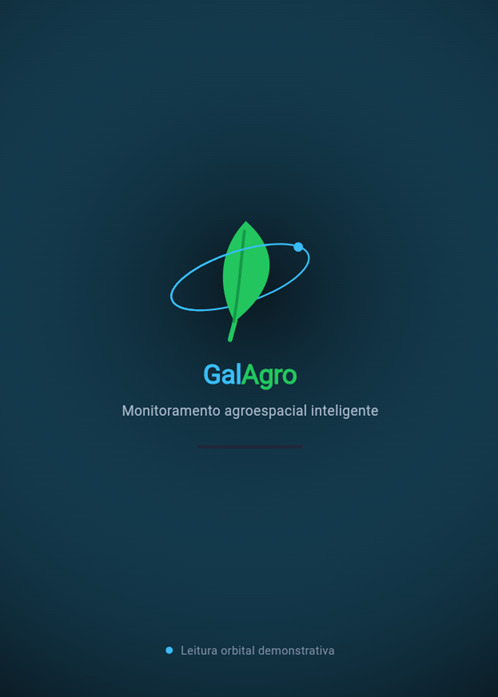
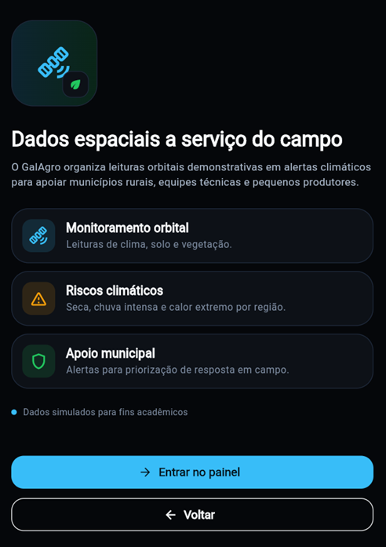
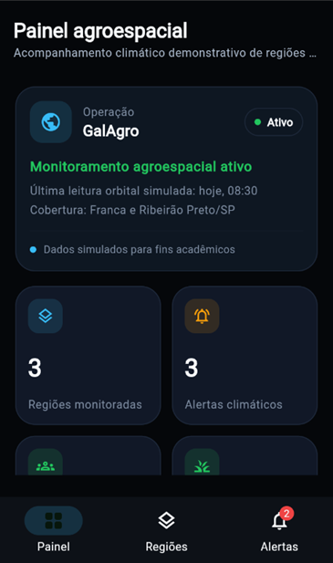
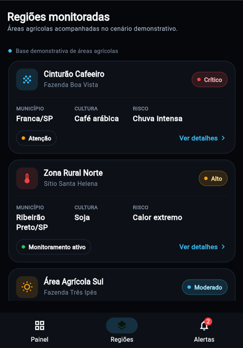
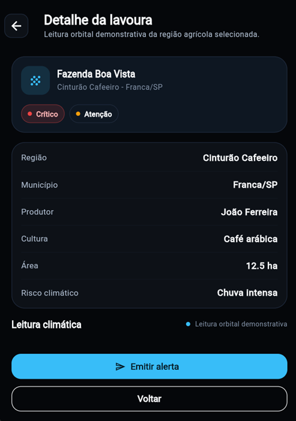
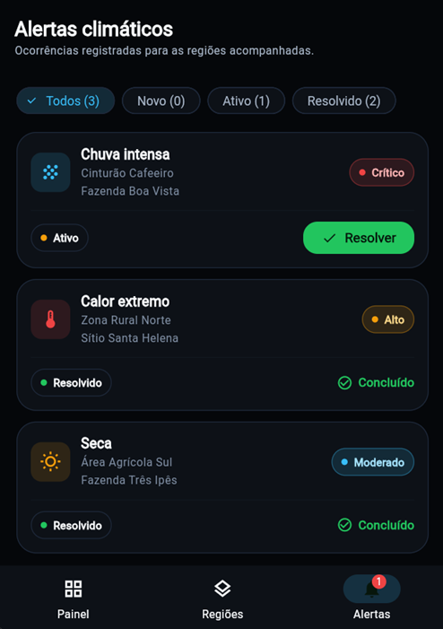

# GalAgro Flutter

Projeto Flutter da disciplina `Desenvolvimento Cross Platform` para a Global Solution.

## Proposta

O `GalAgro` apresenta um painel agroespacial demonstrativo para monitoramento de regioes agricolas com dados orbitais simulados. O foco e apoiar gestores publicos e pequenos produtores com leitura de risco climatico, alertas e orientacoes operacionais.

## Stack

- Flutter
- Dart
- Material 3
- navegacao nomeada com `Navigator`
- dados mockados locais

## Fluxo de telas

1. `Splash`
   - tela inicial com logo da aplicacao
   
2. `Intro`
   - explica a proposta do app e permite avancar ou voltar
   
3. `Dashboard`
   - visao geral da operacao, indicadores e atalhos
   
4. `Regions`
   - lista de regioes monitoradas
   
5. `Region Detail`
   - detalhe tecnico da regiao/lavoura selecionada
   
6. `Alerts`
   - lista de alertas com filtros e mudanca de status
   

Fluxos principais:

- `Splash -> Intro -> Dashboard`
- `Dashboard -> Regions -> Region Detail`
- `Dashboard -> Alerts`

## Interacoes implementadas

- navegacao entre telas
- filtro de alertas por status
- avancar status do alerta
- abrir detalhe de regiao
- emitir alerta a partir do detalhe de regiao

## Organizacao do projeto

- `lib/navigation`: rotas e configuracao de navegacao
- `lib/state`: estado central simples com `ChangeNotifier`
- `lib/repository`: dados mockados e regras locais de atualizacao
- `lib/model`: modelos do dominio
- `lib/ui/screens`: telas do aplicativo
- `lib/ui/components`: componentes reutilizaveis
- `assets/images`: identidade visual e logos

## Como executar

```powershell
flutter pub get
flutter run
```

## Como validar

```powershell
flutter test
flutter build web
```
